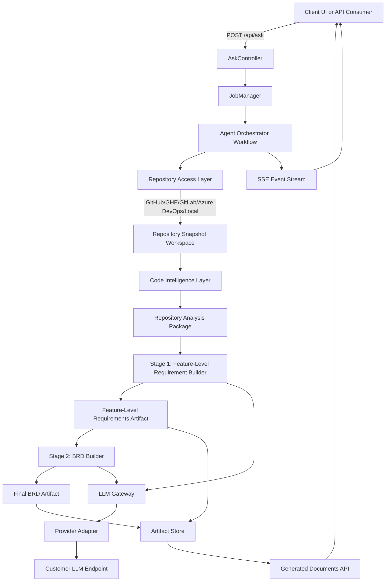

# Autonomous AI Agent Migration Plan

## Goal

Convert the current `github/copilot-sdk`-based document generation service into a production-ready autonomous AI agent service that:

1. Reads source code from customer repositories (including private repos),
2. Generates feature-level requirements from code analysis,
3. Generates a Business Requirements Document (BRD) from those requirements,
4. Preserves the existing functional behavior and output quality.

---

## 1) Current Solution Exploration (As-Is)

## 1.1 Runtime flow

- `POST /api/ask` accepts repository context and user question.
- `AskController` opens/creates a Copilot session via `SessionManager` -> `CopilotService`.
- For `agent === document-generator`, request text is enriched with:
  - repository root path,
  - output directory path,
  - feature requirements output file path,
  - final BRD output file path.
- Prompt is sent as `Use the @document-generator agent...`.
- Response is streamed through SSE (`text/event-stream`).
- Output files are expected in `.copilot-sdk-demo/agent-gen-results/YYYY-MM-DD/...`.

## 1.2 Where behavior is defined

- Agent prompt/instructions are embedded in:
  - `src/server/config/agents.config.ts`
  - `docs/document-generator.agent.md`
- Session orchestration:
  - `src/server/services/session-manager.ts`
  - `src/server/services/copilot.service.ts`
- Repository handling:
  - `src/server/api/repositories.controller.ts`
  - `src/server/config/repos.config.ts`

## 1.3 Production gaps in current design

### Gap A: LLM auth/provider coupling with Copilot SDK

- BYOK mode still depends on `CopilotClient` provider abstraction.
- Model access methods are constrained by Copilot SDK's provider model and wire format expectations.
- This creates incompatibility with customer-specific auth strategies (custom gateways, enterprise identity brokering, signed requests, etc.).

### Gap B: Private repository access limitation

- Repository cloning endpoint explicitly rejects private repositories added by URL:
  - `if (repoMeta.private === true) ... "Only public repositories can be added by URL"`.
- In production, private repositories are the default for customer code.
- Current implementation assumes broad network GitHub access; many enterprises require isolated network placement and VCS proxying.

---

## 2) Target Architecture (To-Be): SDK-Independent Autonomous Agent

## 2.1 Design principles

- No dependency on `@github/copilot-sdk`.
- Pluggable LLM providers through a unified internal adapter.
- Pluggable repository connectors (GitHub, GitHub Enterprise, GitLab, Azure DevOps, local mount).
- Execution close to customer code boundary (self-hosted/isolated).
- Maintain current outputs and UX contract (SSE progress + generated files).

## 2.1.1 Architecture flow diagram



Execution notes:

- `AskController` remains the external entry point for backward compatibility.
- `JobManager` owns lifecycle, retries, cancellation, and job status.
- `Agent Orchestrator Workflow` coordinates deterministic stage transitions.
- `LLM Gateway` isolates provider/auth differences from business workflow logic.
- `Artifact Store` persists both generated documents and structured run metadata.

## 2.2 Proposed components

### A. Agent Orchestrator Service

Purpose: Control the full workflow and state machine.

- Input: repository reference, branch/commit, output preferences, generation request.
- Steps:
  1. Acquire repository snapshot.
  2. Build code index/context.
  3. Run Feature Extraction agent stage.
  4. Run BRD Consolidation agent stage.
  5. Persist artifacts and emit completion event.
- Output: file paths + metadata + stream events.

### B. Repository Access Layer (Connector-based)

Purpose: Access private repositories securely in enterprise environments.

Connector interface:

- `fetchSnapshot(request): SnapshotRef`
- `listFiles(snapshot): FileDescriptor[]`
- `readFile(snapshot, path): string`
- `getRepoMetadata(snapshot): RepoMeta`

Initial connectors:

- GitHub Cloud via App installation token or PAT.
- GitHub Enterprise (custom API and host).
- Local filesystem/mounted workspace connector (for network-restricted environments).

Security controls:

- Shallow clone or archive export per job.
- Ephemeral workspace per request.
- Strict host allowlist.
- Secret retrieval from vault/injected runtime env.

## 2.2.1 Suggestions for programming language agnostic repository reading

Use a two-tier reading strategy so the pipeline works on mixed-language repositories without requiring per-language hard dependencies for every run.

Tier 1: Universal repository reader (always enabled)

- Traverse repository files with include/exclude policies:
  - include: source, config, API specs, migration files, docs, tests (optional),
  - exclude: binaries, media, large generated files, dependencies folders, build outputs.
- Detect language by extension + shebang + lightweight content signature.
- For each file, extract a normalized intermediate representation with:
  - path, language, module guess,
  - symbol candidates (class/function/interface names via regex heuristics),
  - key behavior signals (routes, handlers, validation checks, persistence calls),
  - references to related files (imports/includes).

Tier 2: Language plugins (enabled when parser is available)

- For common languages, use parser-backed plugins for higher precision:
  - TypeScript/JavaScript, Java, C#, Python, Go, Kotlin, etc.
- Plugin output is normalized into the same intermediate representation as Tier 1.
- If plugin parsing fails for a file, fallback to Tier 1 heuristics (never hard-fail entire job).

Normalization contract (language-agnostic IR)

- `FileFact`: file-level metadata and detected responsibilities.
- `SymbolFact`: symbol name/type, visibility, parameters, return shape.
- `BehaviorFact`: action-condition-effect statement mined from code paths.
- `DependencyFact`: external integration or cross-module dependency.
- `TraceFact`: links behavior/symbol to file path and optional line range.

Additional implementation suggestions:

- Add a size budget per file and global budget per repo; summarize overflow files in a second pass.
- Prioritize business logic files first (controllers/services/domain/use-cases) before infrastructure code.
- Keep parser plugins versioned and independently testable to avoid workflow regressions.

### C. Code Intelligence Layer

Purpose: Build analysis-ready context from source code.

- Language-aware file filtering (exclude binaries, lockfiles, generated artifacts).
- Chunking and summarization pipeline.
- Optional embeddings/vector index for large repositories.
- Traceability extraction: map requirement to class/module/file.

### D. LLM Gateway (Provider Adapter)

Purpose: Normalize model invocation and auth across customer LLMs.

Adapter interface:

- `generate(messages, options): Completion`
- `stream(messages, options): AsyncEventStream`
- `supportsTools(): boolean`

Auth modes supported:

- API key,
- OAuth2 client credentials,
- Azure Entra token flow,
- mTLS/signed proxy headers (through enterprise AI gateway),
- custom request signer hook.

### E. Agent Pipeline

Purpose: Keep same business functionality with deterministic stages.

Stage 1: Feature-Level Requirement Builder

- Input: code context + extraction prompt.
- Output: `*-feature-level-requirements-<timestamp>.txt`
- Rules:
  - 3-7 requirements per feature,
  - one sentence per requirement,
  - include validation/error behaviors,
  - include traceability matrix (Req ID -> Feature -> Class/File ref).

Stage 2: BRD Builder

- Input: Stage 1 file + additional context.
- Output: `*-Final-requirements-response-<timestamp>.md`
- Required sections mirror existing behavior:
  - overview, scope, functional requirements, use cases, NFRs (if explicit), dependencies, assumptions, mermaid diagrams, traceability matrix, open questions/risks.

## 2.3 Data contracts between repository reading and Stage 1/Stage 2

This section defines exactly what each stage should receive and produce so implementation remains deterministic and testable.

Formal TypeScript interfaces are maintained in:

- `docs/agent-contracts.repository-analysis.md`
- `docs/agent-contracts.stage-io.md`

### 2.3.1 What exactly is received after reading the repository

Output of repository read + intelligence pass should be a `Repository Analysis Package`:

- **Repository metadata**
  - repository id/name, default branch, analyzed commit SHA, connector type, analyzed timestamp.
- **File inventory**
  - included files, excluded files, exclusion reason, language distribution.
- **Code facts (normalized IR)**
  - `FileFact[]`, `SymbolFact[]`, `BehaviorFact[]`, `DependencyFact[]`, `TraceFact[]`.
- **Feature candidates**
  - machine-detected feature clusters (e.g., Authentication, Document Generation, Repository Management).
- **Execution flow hints**
  - route -> controller -> service -> persistence/integration chains where available.
- **Quality and risk indicators**
  - confidence score per feature cluster,
  - ambiguity flags and unresolved cross-file references.
- **Token-ready context packs**
  - pre-chunked summaries prepared for LLM context windows.

Suggested payload structure:

```json
{
  "repoMeta": {
    "repoName": "string",
    "branch": "string",
    "commitSha": "string",
    "connector": "github|ghe|gitlab|azure|local",
    "analyzedAt": "ISO-8601"
  },
  "inventory": {
    "includedFiles": [],
    "excludedFiles": [],
    "languageStats": {}
  },
  "facts": {
    "fileFacts": [],
    "symbolFacts": [],
    "behaviorFacts": [],
    "dependencyFacts": [],
    "traceFacts": []
  },
  "featureCandidates": [],
  "flowHints": [],
  "contextPacks": [],
  "quality": {
    "coverageScore": 0.0,
    "ambiguities": []
  }
}
```

### 2.3.2 What and how should be passed to Stage 1 (Feature-Level Requirement Builder)

Stage 1 input should include:

- `Repository Analysis Package` (full structured object),
- Stage 1 prompt template version id (for reproducibility),
- output formatting constraints (3-7 requirements per feature, one sentence rule, traceability format),
- run controls (model id, temperature, max tokens, retry policy),
- output path for feature-level requirements file.

How to pass it:

1. Build a compact `Stage1Input` JSON object.
2. Serialize high-signal facts into model-ready prompt context in deterministic order:
   - feature candidates,
   - behavior facts,
   - validation/error behaviors,
   - trace facts.
3. Include a strict output schema in prompt instructions.
4. Validate model response against schema before writing file.
5. Write `*-feature-level-requirements-<timestamp>.txt` + machine-readable sidecar (`.json`) for Stage 2.
6. Stage 1 JSON sidecar is mandatory for debugging and traceability.

Suggested `Stage1Input` contract:

```json
{
  "repoMeta": {},
  "featureCandidates": [],
  "behaviorFacts": [],
  "dependencyFacts": [],
  "traceFacts": [],
  "constraints": {
    "requirementsPerFeatureMin": 3,
    "requirementsPerFeatureMax": 7,
    "singleSentence": true
  },
  "output": {
    "featureRequirementsPath": "absolute-path",
    "featureRequirementsJsonPath": "absolute-path"
  },
  "promptTemplateVersion": "v1"
}
```

Stage 1 output should include:

- Human-readable feature requirements text file (existing expected artifact),
- structured requirements JSON containing:
  - requirement id,
  - feature name,
  - requirement sentence,
  - validation/error notes,
  - traceability references (class/module/file).

### 2.3.3 What and how should be passed to Stage 2 (BRD Builder)

Stage 2 input should include:

- Stage 1 structured output (`featureRequirements.json`) as primary source of truth,
- Stage 1 text artifact (for human wording continuity),
- selected repository context from Stage 0 for enrichment:
  - dependencies,
  - system boundaries,
  - unresolved ambiguity/risk flags,
- required BRD section checklist,
- output path for final BRD markdown.

How to pass it:

1. Build `Stage2Input` object from Stage 1 outputs + selected repository metadata.
2. Provide section-by-section generation instructions with mandatory headings.
3. Require traceability matrix regeneration from structured requirements ids.
4. Run post-generation validator:
   - all required headings present,
   - at least one use case per feature,
   - traceability matrix is not empty.
5. Persist final BRD markdown + optional structured BRD JSON snapshot.
6. Stage 2 JSON sidecar is mandatory for debugging and traceability.

Suggested `Stage2Input` contract:

```json
{
  "repoMeta": {},
  "featureRequirements": [],
  "featureRequirementsTextPath": "absolute-path",
  "dependencies": [],
  "assumptions": [],
  "risks": [],
  "requiredSections": [
    "Project Overview",
    "Scope",
    "Consolidated Functional Requirements",
    "Use Cases",
    "Non-Functional Requirements",
    "Dependencies and Preconditions",
    "Assumptions & Constraints",
    "Mermaid Diagrams",
    "Traceability Matrix",
    "Open Questions/Risks"
  ],
  "output": {
    "brdMarkdownPath": "absolute-path",
    "brdJsonPath": "absolute-path"
  },
  "promptTemplateVersion": "v1"
}
```

### F. Output & Delivery Layer

- Keep repository-scoped output location:
  - `<repoRoot>/.copilot-sdk-demo/agent-gen-results/YYYY-MM-DD/`
- Persist run metadata:
  - model/provider used,
  - commit hash / branch,
  - timing + token usage,
  - confidence/risk flags.
- Stream progress events over SSE:
  - `job.started`, `repo.loaded`, `analysis.completed`, `feature_doc.completed`, `brd.completed`, `job.failed`, `job.completed`.

---

## 3) API/Service Refactor Plan

## 3.1 Replace core service dependencies

- Replace `CopilotService` with `AgentRuntimeService`.
- Replace `SessionManager` with `JobManager` (job-based, not Copilot session-based).
- Keep `AskController` endpoint shape where possible for frontend compatibility.

## 3.2 New internal contracts

- `RepositoryConnector` (private/public repo access abstraction).
- `ModelProviderAdapter` (LLM abstraction).
- `DocumentGenerationWorkflow` (orchestrated multi-stage generation).
- `ArtifactStore` (write/read generated docs).

## 3.3 Backward-compatible transition strategy

- Keep `POST /api/ask` request fields (`repository`, `repositoryPath`, `question`, `agent`, `model`).
- Interpret `agent=document-generator` as new workflow trigger.
- Preserve response SSE shape and final `documents` payload to avoid frontend breakage.

---

## 4) Private Repository Strategy (Production)

Recommended precedence order:

1. **GitHub App installation auth** (best enterprise path),
2. Fine-grained PAT (fallback),
3. Local mounted repository path (fully isolated network),
4. Mirror repository synchronization service (for restricted outbound).

Mandatory controls:

- No credential persistence in generated files or logs.
- Token scope minimization (`contents:read` only when possible).
- Ephemeral checkout cleanup after job completion.
- Repository host allowlist and TLS verification.

---

## 5) LLM Strategy (Customer Model Compatibility)

## 5.1 Provider abstraction

Implement adapters for:

- OpenAI-compatible APIs,
- Azure OpenAI,
- Anthropic-compatible endpoint (if required),
- Enterprise AI gateway (custom).

## 5.2 Prompting and determinism

- Move prompt templates to versioned files in `docs/prompts/` or `src/server/prompts/`.
- Add structured output contracts (JSON schema internally) before writing final text files.
- Add validation pass to ensure required BRD sections are always present.

## 5.3 Reliability controls

- Retries with exponential backoff for transient model/network failures.
- Max-token and context budgeting per stage.
- Fallback model policy per customer environment.

---

## 6) Implementation Roadmap

## Phase 0 - Foundations

- Introduce new interfaces and feature flag:
  - `USE_AUTONOMOUS_AGENT=true|false`
- Keep Copilot path as temporary fallback.

## Phase 1 - Repository connectors

- Implement `GitHubConnector` supporting private repos.
- Add secure credential loading and repository checkout workspace.
- Remove "public only" restriction from repository onboarding flow.

## Phase 2 - LLM gateway

- Implement `ModelProviderAdapter` and at least one provider.
- Add BYOK/customer auth pluggability (token provider hook).

## Phase 3 - Agent workflow

- Implement two-stage generation pipeline.
- Preserve current output filenames and folder patterns.
- Keep SSE progress events and final payload contract.

## Phase 4 - Hardening and observability

- Add structured logging + tracing per job.
- Add prompt/result audit metadata (without storing sensitive source code if disallowed).
- Add performance metrics (repo size, stage duration, token usage).

## Phase 5 - Decommission Copilot SDK path

- Remove `@github/copilot-sdk` dependency.
- Delete old session management code and unused config.
- Final compatibility test with representative customer repos.

---

## 7) Risks and Mitigations

- **Large repositories exceed context windows**  
  Mitigation: chunking, retrieval, staged summarization.

- **LLM variability causes missing BRD sections**  
  Mitigation: schema validation + repair pass.

- **Enterprise network restrictions break direct clone**  
  Mitigation: local connector + mirror/sync connector.

- **Sensitive code leakage concerns**  
  Mitigation: customer-hosted deployment and gateway policy controls.

---

## 8) Suggested Initial File/Code Changes for Implementation (Next Step)

1. Add `src/server/services/agent-runtime/`:
   - `job-manager.ts`
   - `workflow.ts`
   - `types.ts`
2. Add `src/server/services/repository-connectors/`:
   - `base.ts`
   - `github.connector.ts`
   - `local.connector.ts`
3. Add `src/server/services/model-gateway/`:
   - `base.ts`
   - `openai-compatible.adapter.ts`
4. Update `ask.controller.ts` to route `document-generator` requests to new runtime under feature flag.
5. Keep existing generated-document endpoints unchanged.

---

## 9) Acceptance Criteria for Migration

- Service can process private customer repositories.
- Service can use customer-provided LLM/auth independent of Copilot SDK.
- Generated artifacts remain:
  - Feature-level requirements text file,
  - Final BRD markdown file.
- Frontend interaction remains compatible (same ask flow + SSE + document payload).
- End-to-end generation succeeds in isolated enterprise network setup.
- Stage 1 and Stage 2 JSON sidecar artifacts are always produced.
- Repository analysis scope includes source code, tests, and docs by default.

